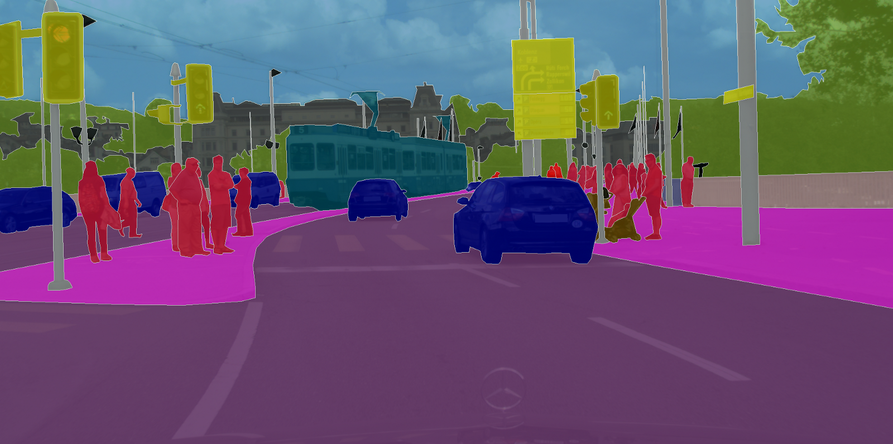

# Semantic Segmentation

🚧 This project still under development. Some scripts might be incomplete. 🏗

Semantic segmentation has become an important component of self-driving vehicles. It allows the car to understand the surroundings by classifying every pixel of the input image.



## 🏃🏻‍♂️ Running...
To run inference on the pre-trained models, please use `segmentor.py`. 

	from segmentor import Segmentor
	seg = Segmentor()
	classes_output, img_viz = seg.semantic_segmentation(image=image, visualization=True)

`classes_output` is the pixel-wise classification result for all the categories. `img_viz` is a RGB image generated based on `classes_output `

The best way to run some actual test is using `test.py`. You must specify the image path by changing the `path` variable. 

The pre-trained weights are stored in the `./weights` directory.

## The Cityscape Dataset 💼

In order to train the model, please download the cityscape dataset, which can be found [here](https://www.cityscapes-dataset.com/). 

Remeber to preprocess the data using this jupyter notebook: `Data Preprocessing.ipynb`. The script will generate `train_labels.csv` and `val_labels.csv`

My data is organized as such:

```
Cityscape
│   train_labels.csv
│   val_labels.csv 
└─── training
│   └─── aachen
│   └─── augsburg
│   .
│ 	.
└─── training_gt
│   └─── aachen
|   └─── augsburg
|	.
|	.
└─── val
│   └─── frankfurt
│   └─── lindau
└─── val_gt
|   └─── frankfurt
|   └─── lindau
```


## Training

There are two training scripts:

- `train_icnet.py`
- `train_fusion.py`

`train.py` is the ICNet training script. `utils.py` contains all the categories (classes). You can modify them based on your dataset. 

## Models

An overview of the different segmentation models in this project. 

### ICNet

ICNet (or image cascade network) is a realtime semantic segmentation model developed by Zhao et al. at The Chinese University of Hong Kong. Their paper shows that ICNet can achieve mIoU of ~70% with the Cityscape dataset, while running at ~30 FPS. After some testing, ICNet became a great choice for self-driving applications. (I am currently using the network on my [self-driving golf cart project](https://github.com/sigmaai/self-driving-golf-cart))


Here is a simple benchmark comparison between ICNet and other popular semantic segmentation models. These images and visualizations
are from the original ICNet paper, which can be found [here](https://arxiv.org/abs/1704.08545).  

<center>

</center>

### FusionNet 🤔

Coming soon...

## About

This project is created for the self-driving golf cart project that I have been working on. For more information on that, please refer to the [Github page](https://github.com/xmeng17/self-driving-golf-cart), or my [website](https://neilnie.com/the-self-driving-golf-cart-project/).

If you have questions, comments or concerns, please contact me at [contact@neilnie.com](mailto:contact@neilnie.com). 